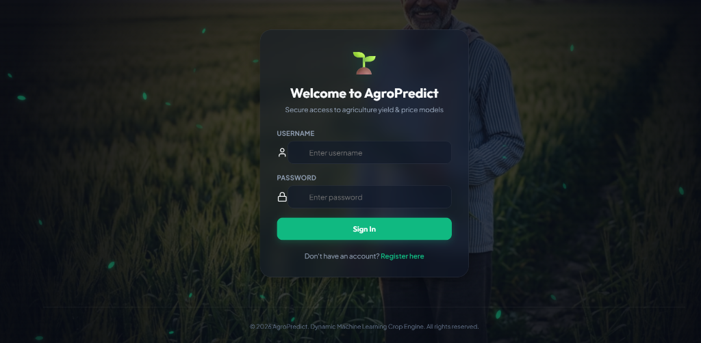
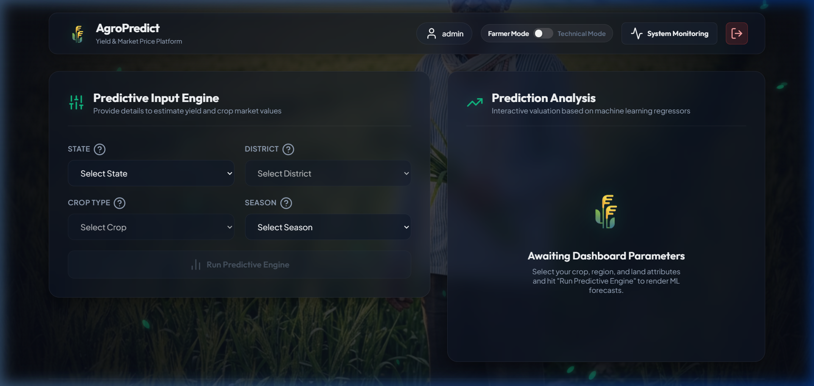
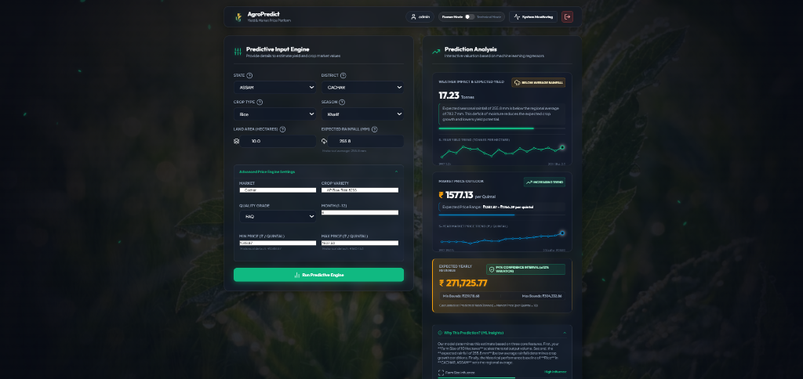

# AgroPredict: Crop Yield & Price Prediction Platform

🚀 **Live Demo:** [https://agropredict-bac9.onrender.com](https://agropredict-bac9.onrender.com)

AgroPredict is a production-ready web application built with FastAPI and SQLite. It provides crop yield predictions (using pre-trained XGBoost models and historical fallbacks for newer regions like Assam) and commodity price forecasts to help farmers, researchers, and administrators make data-driven agricultural decisions.

---

## 🛠 Tech Stack

- **Backend:** FastAPI (Python), Uvicorn (ASGI server)
- **Frontend:** HTML5, Vanilla CSS3, Javascript (Modern ES6 SPA, dynamic inputs, charting)
- **Database:** SQLite (with dynamic environment path config for container volume persistence)
- **Machine Learning:** XGBoost Regression, Scikit-Learn (Ordinal Encoding), Pandas, NumPy
- **Deployment & DevOps:** Docker, Render (Blueprints and Web Services)

---

## 📋 Features

- **Multi-Variable Yield Prediction:** Predicts crop yields using XGBoost regression models based on weather data, location inputs, and crop types.
- **Assam State Support & Fallback Engine:** Handles new location inputs (like Assam) that aren't in the pre-trained model vocabulary by calculating real-time historical average trend estimates.
- **ML Price Forecasting Engine:** Predicts commodity modal prices using market-specific features (variety, grade, min/max price boundaries).
- **Interactive SPA Frontend:** Responsive user dashboard featuring clean parameter selectors, progressive disclosures, and interactive analytics.
- **Administration & Audit Trails:** Real-time log monitoring console tracking prediction latency, total predictions, and security login/auth history.
- **Production-Ready Containerization:** Standardized Docker setup with library support for running models efficiently under Linux environments.

---

## 📸 Screenshots

### Login Screen


### Dashboard Home


### Predictions & Analytical Results


---

## 📁 Project Structure

```text
crop_deploy/
├── static/                  # Frontend Single Page App assets
│   ├── images/              # Dashboard layouts assets
│   ├── js/                  # SPA application scripts & API interaction
│   ├── style.css            # Custom layout stylesheet (with dark mode styling)
│   └── index.html           # Main dashboard index
├── scratch/                 # Utility scripts (pre-processing, scaling parameters, validation tests)
│   ├── align_assam.py       # Aligns and appends Assam data to dataset
│   ├── fit_rainfall.py      # Fits z-score scaling parameters for weather data
│   ├── verify_production_ready.py # Full integration testing script
│   └── ...
├── database.py              # SQLite schemas and prediction logs controller
├── main.py                  # FastAPI application, ML prediction pipeline, fallback triggers
├── requirements.txt         # Python package dependencies
├── Dockerfile               # Production container builder
├── .dockerignore            # Container context exclude rules
├── render.yaml              # Render deployment Blueprint
├── .gitignore               # Git ignore patterns
├── FINAL_CLEAN_AGRI_DATASET.csv # Preprocessed lookup dataset for fallback calculation
├── xgboost_production_model.pkl # Pre-trained yield model
├── xgboost_modal_price_model.pkl # Pre-trained modal price model
├── ordinal_encoder_production_features.pkl # Encoder vocabulary for yield features
└── ordinal_encoder_price_features.pkl # Encoder vocabulary for price features
```

---

## 🚀 Future Improvements

- **Retrain Core Models:** Retrain the XGBoost models with the complete agricultural dataset (including Assam and other new states) to move completely away from historical average fallbacks.
- **Cloud Object Storage:** Move large binary models and dataset CSV files to cloud storage (e.g., AWS S3 or Google Cloud Storage) to reduce git repository size and Docker build times.
- **Role-Based Access Control (RBAC):** Implement granular access permissions for different user roles (e.g., Farmers, Agricultural Researchers, Administrators).

---

## Getting Started Locally

### Prerequisites
- Python 3.11+ (if running bare-metal)
- Docker (recommended)

### Default Admin Credentials
- **Username:** `admin`
- **Password:** `admin123`

---

## Running Locally with Docker

You can package and run the application inside a clean Docker container to avoid local dependency configuration.

1. **Build the Docker Image:**
   ```bash
   docker build -t agropredict .
   ```

2. **Run the Container:**
   ```bash
   docker run -p 8080:8080 -e SECRET_KEY="your_secure_random_key_here" agropredict
   ```
   Open your browser and navigate to `http://localhost:8080` to access the application.

3. **Running with a Local Volume (for database persistence):**
   ```bash
   docker run -p 8080:8080 \
     -e SECRET_KEY="your_secure_random_key_here" \
     -e DB_PATH="/data/crop_app.db" \
     -v "$(pwd)/data:/data" \
     agropredict
   ```

---

## Deploying to Render

### Option 1: Using the Render Blueprint (Recommended)
This repository contains a `render.yaml` Blueprint definition file. Render can read this file to automatically spin up the Web Service, mount a persistent disk, and inject the environment variables.

1. Push this project repository to **GitHub**, **GitLab**, or **Bitbucket**.
2. Log in to your [Render Dashboard](https://dashboard.render.com).
3. Navigate to **Blueprints** and click **New Blueprint Instance**.
4. Connect the repository containing this project.
5. Render will automatically read the `render.yaml` file, provision a standard Web Service, configure a 1GB persistent disk at `/data`, and deploy the service.

### Option 2: Manual Render Deployment

If you prefer to configure the service manually on Render:

1. Create a new **Web Service** on Render and connect your repository.
2. Select **Docker** as the Runtime environment.
3. Choose your instance type:
   - **Free Plan (No Card Required):** Database will run inside the container. It is completely free, but any database logs/new user registrations will reset whenever Render restarts your server (at least once daily).
   - **Paid Plans (Requires Card):** For production persistence, use a paid tier.
4. (Optional) In the **Advanced** section, add the following Environment Variables:
   - `SECRET_KEY`: A secure key for session token signing (e.g., `my_secure_random_key_here`).
   - `DB_PATH`: Set to `/data/crop_app.db` **only** if you are using a persistent disk. If you are on the Free Plan, do not set this variable.
5. **For Paid Plans only (Disk Mount):** Under the **Disks** section, click **Add Disk**:
   - **Name:** `agropredict-data`
   - **Mount Path:** `/data`
   - **Size:** `1 GiB`
6. Click **Create Web Service**. Render will automatically build the `Dockerfile` and start the application on port `8080`.
